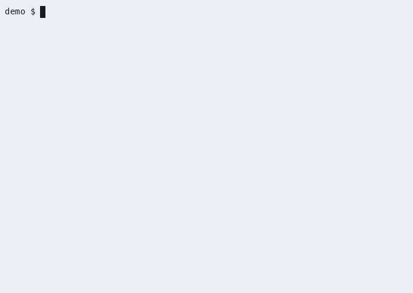
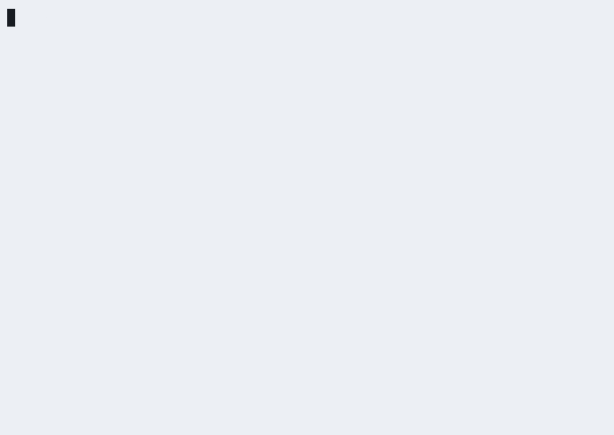

# python-vibe

[](./LICENSE)
[](https://github.com/YauhenBichel/python-vibe/actions/workflows/ci.yml)
[](https://yauhenbichel.github.io/python-vibe/)
[](https://yauhenbichel.github.io/python-vibe/)
[](https://github.com/YauhenBichel/python-vibe#contributors)

Four jobs on your laptop: **ask**, **write a test**, **fix a bug**, **add
one small function**. Only touches the folder you point at. Daily work
is `python-vibe` plus Ollama `llama3.1:8b`. Not everyday-ready.
Site: [yauhenbichel.github.io/python-vibe](https://yauhenbichel.github.io/python-vibe/).

## Run it

```bash
git clone https://github.com/YauhenBichel/python-vibe.git
cd python-vibe
python3 scripts/run/install.py
source .venv/bin/activate
ollama pull llama3.1:8b
cd demo/orders
python-vibe brief
python-vibe ask  "what does compute_total return?"
python-vibe run  "find the NameError and fix it"
```

Activate `.venv` in **every new terminal**. If the shell says
`command not found: python-vibe`, it is not active. The sample project
is `demo/orders` — do not run `brief` on this repository.

`ask` never writes. `run` writes, then runs the tests. The NameError
sample is built into the tool (no model). Another folder:
`python-vibe ask ~/app "what does add return?"`.

[Start](https://yauhenbichel.github.io/python-vibe/start/) ·
[Commands](https://yauhenbichel.github.io/python-vibe/api/) ·
[Contributing](./CONTRIBUTING.md) ·
[Security](./SECURITY.md)

## What it looks like



Replay: `asciinema play docs/media/live-demo.cast`.
Full log: [Live demo](https://yauhenbichel.github.io/python-vibe/live/).

**VS Code** — `python-vibe editors vscode`, then Tasks: Run Task.


Replay: `asciinema play docs/media/vscode-demo.cast`.
[VS Code](https://yauhenbichel.github.io/python-vibe/vscode/).

**Cursor** — `python-vibe editors cursor --allow-writes`, then chat or Tasks.



Replay: `asciinema play docs/media/cursor-demo.cast`.
[Cursor](https://yauhenbichel.github.io/python-vibe/cursor/).

## Scores

One laptop. 29 Aug–5 Sep 2026. **Not everyday-ready.**

| What I tried | Result |
| --- | --- |
| 0.5B as daily work | **0 / 4** vibe, **0 / 2** parse |
| Four Start commands on `demo/orders` | **0 / 4**, then **4 / 4** after the harness |
| Same bench, code must run | 8B **6–9 / 9**; 7B coder 7 / 9; 30B timeout |
| Same-night daily (write tests, clamp, sum × 3) | 8B **9 / 9**, 7B coder **7 / 9**. Keep the 8B |
| Extra 7B–8B on disk | Empty VRAM: DeepSeek first clamp passed; SWE-agent still 180s. Not a nine-cell score |
| A real repository (4,580 files) | reading works; writing **1 / 12** |

The long table: [Experiments](https://yauhenbichel.github.io/python-vibe/investigations/experiments/).
Every score: [Results](https://yauhenbichel.github.io/python-vibe/investigations/).
Which tags timed out: [Hub models](https://yauhenbichel.github.io/python-vibe/investigations/hub-models/).

## More

| If you want | Go here |
| --- | --- |
| What each folder is | [Folders](https://yauhenbichel.github.io/python-vibe/tree/) |
| Tests | `PYTHONPATH=src python -m unittest discover -s tests -q` |
| 0.5B style prior | [YauhenBichel/python-vibe-0.5b](https://huggingface.co/YauhenBichel/python-vibe-0.5b) |
| Train / serve / API | [Commands](https://yauhenbichel.github.io/python-vibe/api/) |
| A first issue | [good first issue](https://github.com/YauhenBichel/python-vibe/labels/good%20first%20issue) |

Vulnerabilities: a **public** GitHub issue. Do not paste live keys.

---

## Contributors

Thank you to everyone who has helped python-vibe.

<!-- readme: contributors,bots/- -start -->
<table>
	<tbody>
		<tr>
			<td align="center">
				<a href="https://github.com/YauhenBichel">
					
					<br />
					<sub><b>Yauhen Bichel</b></sub>
				</a>
			</td>
			<td align="center">
				<a href="https://github.com/xianjianlf2">
					
					<br />
					<sub><b>Mark Xian</b></sub>
				</a>
			</td>
			<td align="center">
				<a href="https://github.com/ItzSaurav">
					
					<br />
					<sub><b>Itzsaurav</b></sub>
				</a>
			</td>
			<td align="center">
				<a href="https://github.com/svkzn">
					
					<br />
					<sub><b>svkzn</b></sub>
				</a>
			</td>
			<td align="center">
				<a href="https://github.com/Aditya-233">
					
					<br />
					<sub><b>Aditya</b></sub>
				</a>
			</td>
			<td align="center">
				<a href="https://github.com/kkkhs">
					
					<br />
					<sub><b>Huangshuo Kuang</b></sub>
				</a>
			</td>
		</tr>
	</tbody>
</table>
<!-- readme: contributors,bots/- -end -->

The list is filled by [Contributors](./.github/workflows/contributors.yml) from GitHub commits (bots omitted). [Contributor graph](https://github.com/YauhenBichel/python-vibe/graphs/contributors) · [good first issue](https://github.com/YauhenBichel/python-vibe/labels/good%20first%20issue)
